# RideLink Platform - System Architecture & Service Decomposition

## 1. System Overview
RideLink is a distributed, service-based backend platform for a ride-sharing service engineered in **Java 21** and **Spring Boot 3.3.4**. It is composed of **four cohesive microservices**, each maintaining strict data isolation with its own dedicated MongoDB database.

```mermaid
graph TB
    subgraph Client_Layer ["Client & Testing Layer"]
        Swagger["OpenAPI / Swagger UI"]
        Postman["Shared Postman Collection"]
    end

    subgraph Microservices ["RideLink Microservices (Java 21 / Spring Boot 3)"]
        subgraph Account_Service ["Account Service (:8081) - Member 1"]
            AS_Ctrl["AuthController / UserController"]
            AS_Sec["JWT Provider & Security Filter"]
            AS_Repo["UserRepository"]
        end

        subgraph Driver_Service ["Driver & Vehicle Service (:8082) - Member 2"]
            DS_Ctrl["DriverController"]
            DS_Geo["Haversine Proximity Dispatcher"]
            DS_Repo["DriverProfileRepository"]
        end

        subgraph Ride_Service ["Ride Management Service (:8083) - Member 3 (Orchestrator)"]
            RS_Ctrl["RideController"]
            RS_SM["Lifecycle State Machine"]
            RS_Clients["REST Interservice Clients"]
            RS_Repo["RideRepository"]
        end

        subgraph Fare_Service ["Fare & Payment Service (:8084) - Member 4"]
            FS_Ctrl["FareController / PaymentController"]
            FS_Engine["Fare Pricing Strategy Engine"]
            FS_Pay["Simulated Payment Processor"]
            FS_Repo["PaymentRepository"]
        end
    end

    subgraph Data_Layer ["Independent Persistence Boundaries (MongoDB 7)"]
        DB_Account[("ridelink_account_db")]
        DB_Driver[("ridelink_driver_db")]
        DB_Ride[("ridelink_ride_db")]
        DB_Fare[("ridelink_fare_db")]
    end

    %% Client access
    Swagger -->|REST / JSON| AS_Ctrl
    Swagger -->|REST / JSON| DS_Ctrl
    Swagger -->|REST / JSON| RS_Ctrl
    Swagger -->|REST / JSON| FS_Ctrl
    Postman -->|REST / JSON| AS_Ctrl
    Postman -->|REST / JSON| DS_Ctrl
    Postman -->|REST / JSON| RS_Ctrl
    Postman -->|REST / JSON| FS_Ctrl

    %% Microservice to Database mapping (Strict isolation)
    AS_Repo --> DB_Account
    DS_Repo --> DB_Driver
    RS_Repo --> DB_Ride
    FS_Repo --> DB_Fare

    %% Interservice Communication (Synchronous REST via Spring RestClient)
    RS_Clients -.->|1. Validate Passenger Status| AS_Ctrl
    RS_Clients -.->|2. Upfront Fare Estimate| FS_Ctrl
    RS_Clients -.->|3. Find Nearby Available Drivers| DS_Ctrl
    RS_Clients -.->|4. Update Driver BUSY/AVAILABLE| DS_Ctrl
    RS_Clients -.->|5. Final Fare Calculation & Payment| FS_Ctrl
```

---

## 2. Microservice Boundaries and Responsibilities

| # | Microservice | Port | Owner | Key Business Capabilities | Database |
|---|---|---|---|---|---|
| 1 | **Account Service** | `8081` | Member 1 | Passenger & driver registration, BCrypt password hashing, JWT token issuance & validation, RBAC (`ROLE_PASSENGER`, `ROLE_DRIVER`, `ROLE_ADMIN`), profile viewing/updating, account status lifecycle (`ACTIVE`, `SUSPENDED`, `DEACTIVATED`). | `ridelink_account_db` |
| 2 | **Driver & Vehicle Service** | `8082` | Member 2 | Driver operational profile, vehicle registration (SEDAN, SUV, HATCHBACK, MOTORBIKE), availability toggle (`AVAILABLE`, `BUSY`, `OFFLINE`), simulated GPS tracking, Haversine geospatial proximity search for eligible drivers. | `ridelink_driver_db` |
| 3 | **Ride Management Service** | `8083` | Member 3 | Central ride booking orchestrator, pickup/destination coordinate handling, driver matching dispatch, full lifecycle state machine (`REQUESTED` $\rightarrow$ `ASSIGNED` $\rightarrow$ `ACCEPTED` $\rightarrow$ `IN_PROGRESS` $\rightarrow$ `COMPLETED` / `CANCELLED`), transition validation. | `ridelink_ride_db` |
| 4 | **Fare & Payment Service** | `8084` | Member 4 | Upfront fare estimation, final fare calculation via documented pricing rule (base fare + distance charge + duration charge * vehicle multiplier * surge), simulated payment processing (`PAID`, `FAILED`), receipt generation. | `ridelink_fare_db` |

---

## 3. Architectural Comparison: Microservices vs. Monolith

| Dimension | RideLink Microservices Architecture | Monolithic Alternative |
|---|---|---|
| **Data Ownership** | Strict per-service database boundary. No service directly queries another's database. Zero coupling between schemas. | Single shared database with cross-table foreign keys and joins, risking database bottleneck and schema lock-in. |
| **Fault Isolation** | High. If `Fare & Payment Service` is degraded, `Account Service` and `Driver Service` remain fully functional; `Ride Service` gracefully degrades via fallback logic. | Low. A memory leak or crash in payment processing brings down the entire application. |
| **Independent Scalability**| High. `Driver Service` (high-frequency location updates) and `Ride Service` (peak demand matching) can scale horizontally without scaling Account or Fare services. | All modules must scale together, leading to inefficient resource utilization. |
| **Team Autonomy** | Excellent. Each of the 4 group members owns and develops a distinct service codebase, tests, and database independently. | High risk of Git merge conflicts and coordination overhead across shared codebases. |
| **Operational Complexity** | Requires network communication, circuit breakers/fallbacks, and distributed testing. | Simpler local execution and deployment with a single artifact. |
