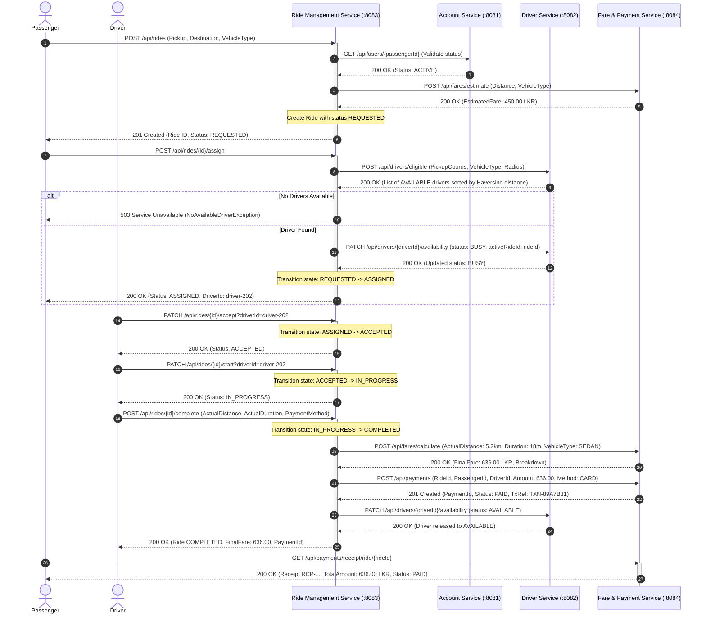
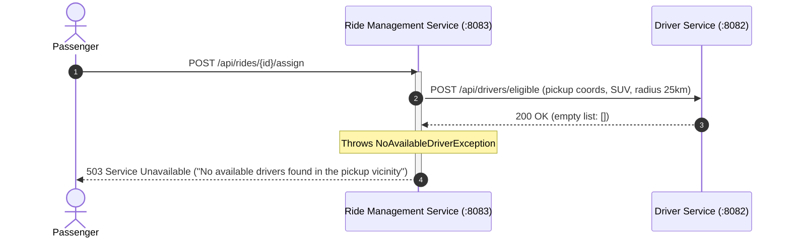
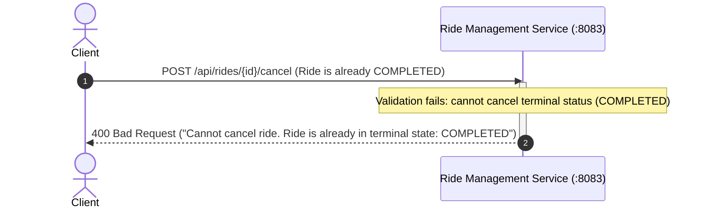

# RideLink Platform - Interservice Sequence Diagrams

## 1. End-to-End Ride Booking, Lifecycle, and Payment Flow

---

## 2. Negative Scenarios Sequence

### Negative Scenario 1: No Available Driver

### Negative Scenario 2: Invalid State Transition

